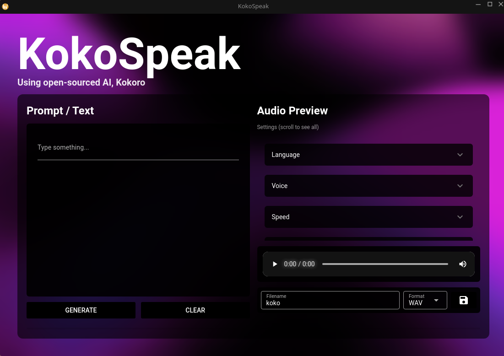

# KokoSpeak

A text-to-speech application that uses the open-source AI, Kokoro, to generate audio from text input.

> **Run it on your own machine, completely offline and for free!** All processing is done locally, ensuring your data stays private.

## Preview


[https://github.com/user-attachments/assets/045c261f-f2e0-4610-bcee-b34ddec6aca2](https://github.com/user-attachments/assets/4baeeb52-7a2b-4d5a-b787-8098bfc773bc)

## Features

- **Language Selection:** Choose from a wide range of languages:
  - American English
  - British English
  - Japanese
  - Mandarin Chinese
  - French
  - Hindi
  - Italian
  - Spanish
  - Brazilian Portuguese
- **Voice Selection:** A diverse selection of male and female voices for each language.
- **Speed Control:** Adjust the audio speed from 0.80x to 1.20x for faster or slower speech.
- **Pitch Control:** Modify the audio pitch from -2.00 to +2.00 octaves to change the tone of the voice.
- **Multiple Output Formats:** Save the generated audio in WAV, FLAC, OGG, or MP3 formats.
- **Real-time Preview:** Listen to the generated audio with an integrated audio player before saving.
- **Custom Filename:** Specify a custom filename for your saved audio files.
- **Clear and Generate:** Easily clear the text input or generate new audio with dedicated buttons.
- **Progress Indicator:** A progress bar provides visual feedback during audio generation.
- **Status Messages:** Get informative messages about the status of audio generation and saving.
- **Error Handling:** The UI displays clear error messages if audio generation or saving fails.
- **Responsive Design:** The user interface is designed to work on various screen sizes.

## Available Languages and Voices

1.  **American English**
    - F · Heart
    - F · Alloy
    - F · Aoede
    - F · Bella
    - F · Jessica
    - F · Kore
    - F · Nicole
    - F · Nova
    - F · River
    - F · Sarah
    - F · Sky
    - M · Adam
    - M · Echo
    - M · Eric
    - M · Fenrir
    - M · Liam
    - M · Michael
    - M · Onyx
    - M · Puck
    - M · Santa
2.  **British English**
    - F · Alice
    - F · Emma
    - F · Isabella
    - F · Lily
    - M · Daniel
    - M · Fable
    - M · George
    - M · Lewis
3.  **Japanese**
    - F · Alpha
    - F · Gongitsune
    - F · Nezumi
    - F · Tebukuro
    - M · Kumo
4.  **Mandarin Chinese**
    - F · Xiaobei
    - F · Xiaoni
    - F · Xiaoxiao
    - F · Xiaoyi
    - M · Yunjian
    - M · Yunxi
    - M · Yunxia
    - M · Yunyang
5.  **French**
    - F · Siwis
6.  **Hindi**
    - F · Alpha
    - F · Beta
    - M · Omega
    - M · Psi
7.  **Italian**
    - F · Sara
    - M · Nicola
8.  **Spanish**
    - F · Dora
    - M · Alex
    - M · Santa
9.  **Brazilian Portuguese**
    - F · Dora
    - M · Alex
    - M · Santa

## Technologies Used

- **Kokoro:** The core text-to-speech engine.
- **NiceGUI:** For the web-based user interface.
- **FFmpeg:** For audio processing and format conversion.

## Setup and Usage

1.  **Install Dependencies:**

    ```bash
    pip install -r requirements.txt
    ```

2.  **Run the Application:**

    ```bash
    python main.py
    ```

3.  **Open the UI:**
    The application will open in a new window.

## File Structure

- `main.py`: The main application script.
- `requirements.txt`: A list of the Python dependencies.
- `generated/`: The default directory for saved audio files.
- `assets/`: Contains static assets for the UI.
